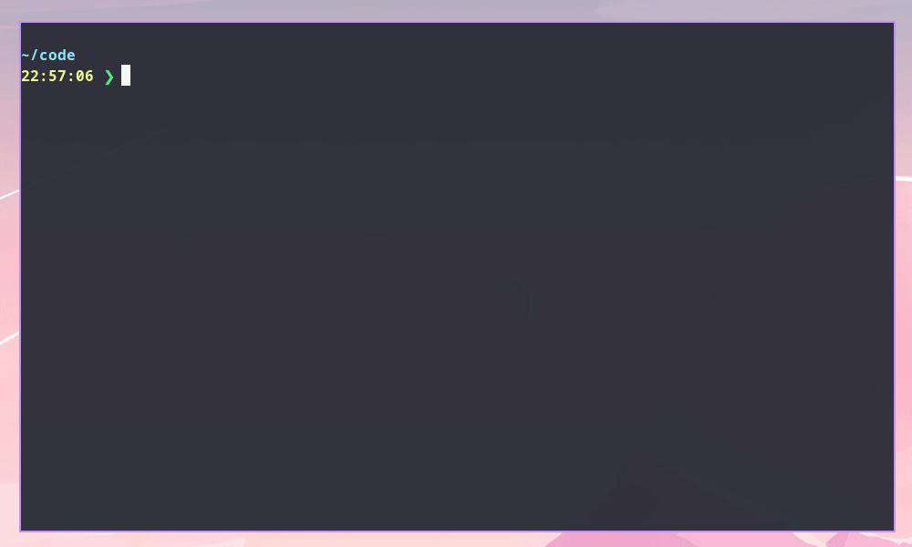

# Nix Flakes Templates

Here be `nix` templates for various things.

## [Haskell](./haskell)

A "complete" Haskell setup with basic toolchain, `hls`, and other goodies 🍬.



## [NodeJS](./nodejs)

A very basic `nodejs` based setup with `npm`.

### Usage

Initialize a new `nodejs` project in `<destination>`:

```sh
nix flake new <destination> -t github:myme/nix-templates#nodejs
```


